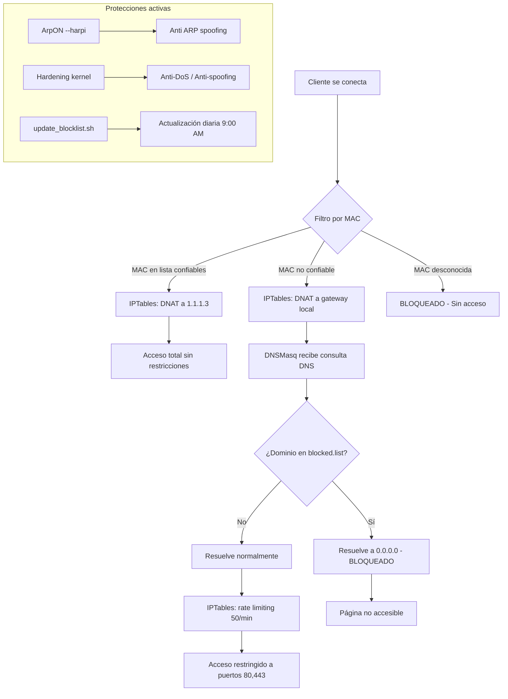

# 💫 ¡Hola! Soy **discentepermanente**  

¡Bienvenidos a mi perfil de GitHub!

📌 **Acerca de mí**  
Soy profesor de Matemática y Física, con una gran pasión por el desarrollo de software. Actualmente estoy aprendiendo y mejorando mis habilidades en desarrollo web, enfocándome en crear aplicaciones funcionales y bien estructuradas.

Me interesa especialmente el **desarrollo backend** y la **integración de bases de datos**, aunque también disfruto involucrarme en todo el proceso de construir algo desde cero.

---

## 💻 Tecnologías utilizadas

---

## 📁 Proyecto destacado

### 🔧 [Pasarela de red con dnsmasq + ArpON](https://github.com/discentepermanente/PasarelaDeRedDNSMasq)

Esta pasarela de red fue implementada en **Ubuntu 22.04/24.04 LTS**, utilizando una PC de prueba con 4 GB de RAM y 128 GB de SSD.  
Está orientada a un **centro educativo** donde se provee Internet a **150 clientes**, divididos en dos grupos:

| Tipo de cliente | Restricciones |
|----------------|---------------|
| **Clientes de confianza** | Sin restricciones de navegación |
| **Clientes de desconfianza** | Restricciones a dominios de contenido pornográfico, juegos, apuestas, etc. |

### 📋 Descripción de la pasarela

La pasarela actúa como un **intermediario de red** que controla todo el tráfico entre los clientes del centro educativo e Internet. Su funcionamiento se basa en cuatro pilares fundamentales:

**1. Filtrado por dirección MAC**  
Cada dispositivo cliente se identifica únicamente por su dirección MAC. Las MACs de los equipos de confianza (docentes, administración) están registradas en una lista blanca dentro del script. Los equipos no confiables (alumnos) también tienen sus MACs registradas, pero con restricciones. Cualquier MAC desconocida es bloqueada automáticamente.

**2. Secuestro del DNS**  
Cuando un cliente no confiable intenta usar un servidor DNS externo (como 8.8.8.8 de Google), las reglas de iptables redirigen forzosamente su consulta al servicio DNS de la propia pasarela. Esto hace **imposible** que un estudiante eluda los bloqueos simplemente cambiando la configuración DNS de su equipo.

**3. Bloqueo de dominios por lista**  
La pasarela mantiene una lista actualizada de dominios prohibidos (pornografía, apuestas, juegos, redes sociales, etc.). Cuando un cliente no confiable solicita uno de estos dominios, dnsmasq lo resuelve a la dirección `0.0.0.0`, haciendo que la página sea inaccesible. La lista se actualiza **automáticamente cada día a las 9:00 AM** mediante un script que descarga fuentes externas como StevenBlack y Easyprivacy.

**4. Protección multicapa**  
- **Kernel hardening**: El sistema está configurado con parámetros de seguridad extrema: IPv6 desactivado, anti-spoofing, syncookies anti-DoS, ASLR, bloqueo de ping, etc.  
- **Firewall iptables**: Limita la velocidad de peticiones (50 por minuto), bloquea puertos de shell inversa, detecta escaneos de puertos y protege el servicio DHCP contra ataques.  
- **ArpON --harpi**: Protege la red contra ataques de ARP spoofing (suplantación de identidad en la red local), tanto en la interfaz LAN como en la WAN.  
- **Persistencia**: Todas las reglas de firewall sobreviven a reinicios gracias a `netfilter-persistent` y a un script de respaldo.

**Resultado final**: Un cliente no confiable solo puede navegar por sitios permitidos (puertos 80 y 443), con límite de velocidad, sin poder cambiar su DNS, sin poder hacer ping a la pasarela, y con los dominios prohibidos completamente inaccesibles. Un cliente confiable, en cambio, navega sin restricciones ni límites.

### 🔄 Flujo de datos

---

### 📂 Scripts Auxiliares
-  Script	Función	Ejecución
-  update_blocklist.sh	Descarga 5 listas remotas, convierte a formato dnsmasq, elimina duplicados	Diaria 9:00 AM (crontab)
-  iptables_backup.sh	Respaldo completo de reglas iptables	Persistente post-reinicio
---
🔗 Repositorio del proyecto - Pasarela de red con dnsmasq

### [Enlace al Repositorio](https://github.com/discentepermanente/PasarelaDeRedDNSMasq)
---

### 📫 Contacto
📧 Correo electrónico: itsi10160@gmail.com
    
    
    
    
    
    
    
    
    
    
    
    
    
    
    
    
    
    
    
    
    
    
